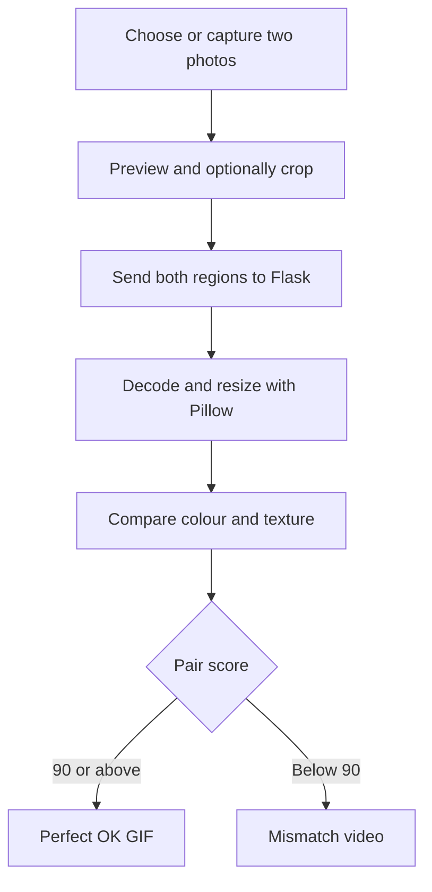

# SockCheck 🧦

> **Every sock deserves to find its soulmate.**

SockCheck is a local Flask-based computer-vision prototype that compares **two separate sock photos** using colour and texture similarity. Each sock gets its own image preview and camera input. Users can compare the complete photos or crop similar fabric areas before running the check.

Because finding one sock is apparently easy. Finding the other one is where the plot begins.

## Team Yuga

- **Kadeeja**
- **Amal**

## The Problem (that doesn't exist)

Every laundry session produces the same mystery: one sock returns safely, while its partner appears to have entered another dimension. People then spend valuable time comparing colours, patterns and suspiciously similar pieces of fabric by eye.

This leads to:

- Lonely socks waiting indefinitely for emotional closure
- Humans wearing almost-matching socks and pretending it was intentional
- Several dramatic minutes lost before college, work or a hackathon presentation
- An unsolved question: where do the missing socks actually go?

## The Solution (that nobody asked for)

SockCheck allows the user to upload or capture two sock photos, select comparable regions and receive a visual similarity result. The Flask server evaluates colour distribution and fabric texture, then returns:

- **Likely Match**
- **Likely Different**
- **Uncertain**

When the conservative pair-match score is **90 or above**, SockCheck celebrates with the **Perfect OK** GIF. When it is below 90, it plays the mismatch video—because some bad news deserves a soundtrack.

## Main Features

- Upload two separate sock photos
- Capture each sock using the device camera
- Preview both images inside the application
- Compare the complete photos or crop similar areas
- Drag to crop on computers
- Tap two opposite corners to crop on touch screens
- Compare colour distribution and fabric texture
- Display pair-match, colour and texture scores
- Show the **Perfect OK** GIF for scores of 90 or above
- Play a mismatch video with audio for scores below 90
- Show a cinematic welcome image for approximately four seconds
- Automatically open the detector after the welcome screen
- Responsive interface for computers and mobile devices
- Process images in memory without permanently saving them

## Technical Details

### Technologies/Components Used

#### Software

| Component | Purpose |
| --- | --- |
| Python | Backend programming language |
| Flask | Web server, routes and comparison API |
| HTML | Page structure and detector interface |
| CSS | Responsive and cinematic styling |
| JavaScript | Image preview, cropping, camera access and result media |
| Pillow | Image decoding, orientation correction and resizing |
| NumPy | Colour and texture calculations |
| Gunicorn | Production server for online deployment |
| VS Code | Development environment |
| Git and GitHub | Version control and project hosting |

#### Hardware

No dedicated hardware is required. SockCheck works with:

- A computer or phone
- A camera or two saved sock photographs
- A browser such as Chrome or Microsoft Edge
- Optional internet access for online deployment

## Implementation

The comparison follows these steps:

1. The user selects or captures one image for Sock A and another for Sock B.
2. The browser displays each image on a canvas.
3. The user optionally selects a crop around the relevant sock fabric.
4. JavaScript exports the two selected areas as image files.
5. The browser sends both images to Flask through the `/compare` endpoint.
6. Pillow corrects orientation, validates the images and resizes them.
7. NumPy calculates colour-histogram, average-colour and texture features.
8. The server returns the match, colour and texture similarity scores.
9. The interface displays the verdict and the appropriate celebration or mismatch media.



## Project Structure

```text
SockCheck-Flask/
├── app.py
├── detector.py
├── requirements.txt
├── README.md
├── templates/
│   ├── login.html
│   └── index.html
├── static/
│   ├── app.js
│   ├── style.css
│   ├── login.css
│   ├── extras.css
│   ├── favicon.svg
│   ├── login-hero.jpg
│   ├── perfect-ok.gif
│   └── not-same.mp4
├── docs/
│   ├── Screenshot 2026-09-12 092747.png
│   ├── Screenshot 2026-09-12 092800.png
│   └── Screenshot 2026-09-12 092816.png
└── tests/
    └── test_app.py
```

## Installation

### Windows and VS Code

1. Download or clone the repository.
2. Extract the ZIP if necessary.
3. In VS Code, select **File → Open Folder**.
4. Open the folder that directly contains `app.py` and `requirements.txt`.
5. Select **Terminal → New Terminal**.
6. Run these commands in PowerShell:

```powershell
py -m venv .venv
.\.venv\Scripts\python.exe -m pip install -r requirements.txt
```

If `py` is unavailable but `python` works, use:

```powershell
python -m venv .venv
```

The later commands remain unchanged. The virtual environment does not need to be activated because its Python executable is used directly.

## Run

Start SockCheck with:

```powershell
.\.venv\Scripts\python.exe app.py
```

Open the following address in Chrome or Microsoft Edge:

```text
http://127.0.0.1:5000
```

Keep the terminal open while using SockCheck. Press **Ctrl+C** to stop the server.

Do not double-click the HTML files. Flask must render the pages and provide the `/compare` API.

## How to Use

1. Open SockCheck in the browser.
2. Wait approximately four seconds for the cinematic welcome screen.
3. Choose or capture a photo for Sock A.
4. Choose or capture a separate photo for Sock B.
5. Crop similar fabric areas if the photos contain background, skin, shoes or trousers.
6. Click **Compare socks**.
7. Review the pair-match, colour and texture scores.

For better results, use similar lighting, distance, angle and crop area in both photographs.

## Result Behaviour

| Pair-match score | Interface behaviour |
| --- | --- |
| 90–100 | Shows the Perfect OK GIF |
| Below 90 | Shows and attempts to play the mismatch video |

The pair-match score uses the lower of the colour and texture scores. This conservative approach prevents one strong feature from hiding a major difference in another.

Browsers may block automatic audio. If that happens, SockCheck keeps the video visible and displays a button that the user can press to start playback with sound.

## Camera and Phone Access

Camera capture requires browser permission and a secure context. Camera access normally works at `http://localhost:5000` or `http://127.0.0.1:5000` on the computer running Flask.

To make the app available to another device on the same Wi-Fi network:

```powershell
.\.venv\Scripts\python.exe app.py --host 0.0.0.0
ipconfig
```

Open `http://YOUR-PC-IP:5000` on the phone, replacing `YOUR-PC-IP` with the computer's Wi-Fi IPv4 address. Allow Python through Windows Firewall when prompted.

Live camera access may be blocked over a plain HTTP LAN address. Selecting a saved photograph should still work.

## Project Documentation

### Screenshots


### Schematic and Circuit

Not applicable. No custom circuit was harmed—or even created—during this project.

### Build Photos

Not applicable. The build process consisted mainly of code, caffeine and negotiating with missing socks.

## Privacy

SockCheck processes uploaded photographs in the Flask server's memory. It does not:

- Save the photos permanently
- Send photographs to an external AI service
- Store personal information
- Require internet access for local comparison

## Important Limitations

SockCheck is a hackathon prototype based on handcrafted similarity measurements. It is **not a trained artificial-intelligence model** and cannot:

- Automatically confirm that an image contains a sock
- Prove that two socks came from the same original pair
- Confirm that a person is wearing the socks
- Reliably recognise every logo or complicated pattern
- Guarantee accurate results under different lighting or camera angles
- Treat its scores as probability or scientific confidence percentages

Similar backgrounds can create misleading results. Different folds, stretched fabric, shadows and image compression can reduce the score of two matching socks.

## Run Automated Checks

```powershell
.\.venv\Scripts\python.exe -m unittest discover -s tests -v
```

The tests cover page loading, the two-image upload flow, identical and different colours, matching striped patterns, invalid files, poor exposure and upload-size limits. They do not measure real-world accuracy or operate a physical camera.

## Troubleshooting

- **`requirements.txt` or `app.py` not found:** open the folder that directly contains those files before running commands.
- **`No module named flask`:** install the requirements using the `.venv` Python command shown above.
- **Port already in use:** stop the existing server with **Ctrl+C**, or run `app.py --port 5001` and open `http://127.0.0.1:5001`.
- **Camera denied:** allow camera permission in the browser's site settings or select a saved photograph.
- **Unsupported image:** use JPG, PNG or WebP under 10 MB and 20 megapixels.
- **Video has no sound:** press the displayed playback button; browsers commonly block automatic sound.

## Future Improvements

- Automatic sock detection and background removal
- Pattern and logo recognition
- Deep-learning image embeddings
- Live two-sock camera detection
- Automatic left- and right-sock separation
- Dataset-based evaluation and calibrated thresholds
- Result history and comparison reports
- Improved handling of folds, shadows and different lighting
- Mobile application support

## Project Demo

- **Repository:** [github.com/amalben1801-ops/sockcheck](https://github.com/amalben1801-ops/sockcheck)
- **Local application:** `http://127.0.0.1:5000`

## Team Contributions

- **Kadeeja:** Project ideation, testing, presentation and user-experience input
- **Amal:** Flask implementation, interface integration, comparison workflow and deployment setup

## Conclusion

SockCheck demonstrates how simple computer-vision techniques can compare two sock photographs through colour and texture. It turns a tiny everyday inconvenience into an interactive hackathon prototype—because if technology can identify faces, objects and galaxies, it can at least try to reunite two socks.

---

Made with Python, Flask and unreasonable concern for lonely socks by **Team Yuga**.
